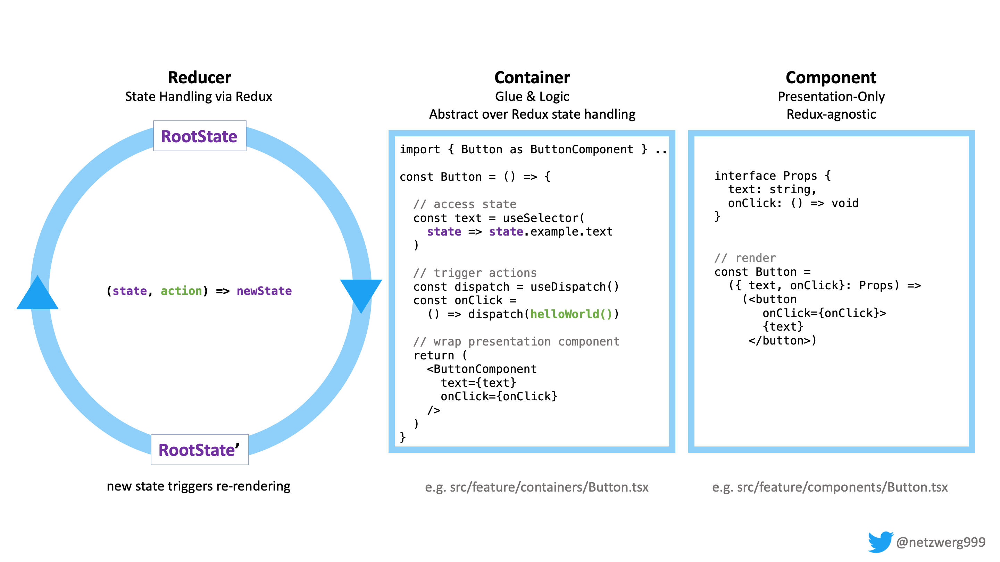

= react-you-do-you

image:https://github.com/netzwerg/react-you-do-you/actions/workflows/main.yml/badge.svg[]

An example of how I use React + Redux + Material-UI + TypeScript.

Or: The code I wish existed when I got started. +
Or: A project template to start off on the right foot.

This is how I do it – *you do you* 💖

Deployed live version: ✨ https://netzwerg.github.io/react-you-do-you ✨

== Setup & Tooling
**  https://reactjs.org[React 17] based on https://vitejs.dev[Vite]:
*** Compilation, linting, etc.
*** Development mode with auto-reloading
*** Test watcher
*** Optimized production build
*** see <<scripts, Available Scripts>>
** https://www.typescriptlang.org/[TypeScript 4.4] for compile-time safety
** https://prettier.io[Prettier] for formatting, auto-triggered on commit via https://github.com/typicode/husky[Husky]
** https://redux-toolkit.js.org[Redux Toolkit] for state management
** https://material-ui.com/[Material UI 4] component library (incl. CSS-in-TS)
** https://storybook.js.org/[Storybook] to build & test UI components in isolation
** GitHub Actions & Pages Continuous Delivery

== Structure
Organize *by feature*:

* Each feature gets its own folder:
** Defines its own slice of models/actions/reducer
** Defines its own components, clearly separated into presentation (inside `components` folder) and glue-code/logic (inside `containers` folder)
** Exports selectively through its `index.ts` file

When using the feature:

* Only ever import what is officially exported:
** ✅ `import { Foo } from './feature-x'`
** 🚫 `import { SecretInternalComponent } from './feature-x/components/SecretInternalComponent'`)
* Avoid circular dependencies – sooner or later, a `shared` folder will be needed ;-)

== State Management

* Keep state in a *fully typed, immutable* model:
** Use interfaces or type aliases rather than classes (rule of thumb: prefer interfaces because they give better compile error message, use type aliases for sum type awesomeness)
** Use TypeScript's `readonly` keyword and `Readonly[Array|Stream|Set|Map]` utility types
* Use https://redux-toolkit.js.org[Redux Toolkit], an _"opinionated, batteries-included toolset for efficient Redux development"_
** Compose feature-specific reducers
** Write container components to connect presentation components to the Redux store. *Why?* Presentation components are more re-usable if they don't know how state is shaped nor how it's managed.
** Use https://github.com/reduxjs/redux-thunk[redux-thunk] for async actions
** Optional: https://redux-toolkit.js.org/usage/immer-reducers[Write Reducers with Immer]

== Broad Overview

== User Interface

Use https://material-ui.com/[Material-UI], a React component library based on https://en.m.wikipedia.org/wiki/Material_Design[Material Design]:

* Huge selection of components, fully customizable
* Theme support (e.g. light vs dark)
* CSS in JS (or in TS, actually): Reusable, component-scoped styles

== Testing

I am mostly developing prototypes these days, so I am not an expert when it comes to testing.
However, this is the minimum I *always* test:

* Slices: Making sure each action is handled correctly (~80% of my logic)
* Error-free rendering of each component ("Rendering Smoke Tests")

== Storybook

The project contains a full https://storybook.js.org[Storybook] configuration.
Writing stories for your UI components allows building & testing them in isolation.
Example stories are contained in link:src/stories[src/stories].

To run locally:

`yarn run storybook`

== Continuous Integration & Delivery

On every push, tests are run via link:.github/workflows/main.yml[GitHub Actions].
If successful, the app is deployed to https://netzwerg.github.io/react-you-do-you via GitHub Pages.

== Usage

=== Explore Locally

[source]
----
git clone https://github.com/netzwerg/react-you-do-you.git
cd react-you-do-you
yarn install
yarn start
----

_Feel free to use `npm` rather than `yarn` – I have a slight preference for `yarn`, mainly because of https://yarnpkg.com/lang/en/docs/selective-version-resolutions/[resolutions] support_

=== As Project Template

* Rename root folder to `my-fancy-new-project-name`
* Replace all occurrences of `react-you-do-you` with `my-fancy-new-project-name`
* Remove existing Git repo: `rm -rf .git`
* Initialize a new Git repo: `git init`

[[scripts]]
== Available Scripts

=== `yarn start`

Compiles and runs the app in development mode.

Open http://localhost:3000 to view it in the browser.

The page will reload if you make edits.
You will also see any compile or lint errors in the console.

=== `yarn test`

Launches the test runner in interactive watch mode.

=== `yarn run build`

Builds the app for production to the `build` folder.

=== `yarn run lint`

Runs ESLint (with TypeScript support) on all `&#42;.ts` or `&#42;.tsx` files in the `src` directory.

=== `yarn run lint:fix`

Runs ESLint (with TypeScript support) on all `&#42;.ts` or `&#42;.tsx` files in the `src` directory, automatically *fixing* problems.

=== `yarn run storybook`

Runs Storybook

&copy; Rahel Lüthy 2021 – link:LICENSE[MIT License]
